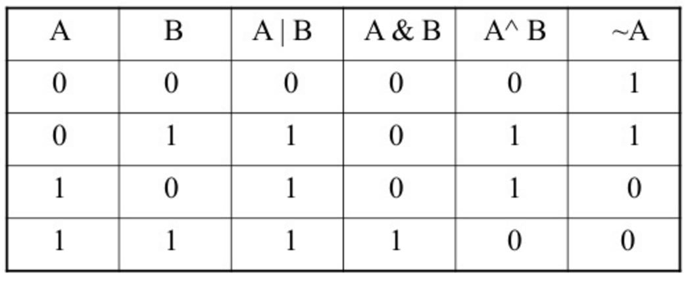

<h1>0x14. C - Bit manipulation </h1>
 
  

<h2>Tasks :</h2>

1. Convert binary number to unsigned int.

2. Print binary representation of a number.

3. Return value of bit at a given index.
 

4. Set value of a bit to 1 at a specific index.

5. Set value of a bit to 0 at a certain index.

6. Determine number of bits to flip to transition from one number to another.

